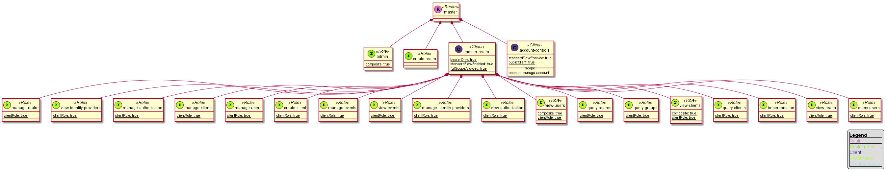

# Keycloak realm graphical representation

The main goal of this project is to generate quick representation of realm configuration based on plantuml.
This service would make easier understanding and conception of authentication process with Keycloak.




## Table of Contents
<details><summary>display</summary>

- [Keycloak realm graphical representation](#keycloak-realm-graphical-representation)
  - [Table of Contents](#table-of-contents)
  - [Prerequisites](#prerequisites)
  - [Installing](#installing)
  - [Usage](#usage)
  - [Versioning](#versioning)
  - [Changelog](#changelog)
  - [Limitations](#limitations)
    - [I want to generate huge diagrams!](#i-want-to-generate-huge-diagrams)
  - [Contributing](#contributing)
  - [Authors](#authors)
  - [License](#license)

</details>

## Prerequisites

* Node >=12
* [Keycloak](https://www.keycloak.org)
* Plantuml viewer ([vscode](https://marketplace.visualstudio.com/items?itemName=jebbs.plantuml))

## Installing

```
npm install @malysus/krepresentation -g
```

## Usage

```
krepresentation -h
or
npx @malysus/krepresentation -h
```
example:
```
docker run --rm -d  -p 8180:8080 -e KEYCLOAK_USER=keycloak -e KEYCLOAK_PASSWORD=keycloak jboss/keycloak
krepresentation -u keycloak -p keycloak -s http://localhost:8180 -r master -o example/master.puml -o example/master.png -f "(test|test1)"
code master.puml
```

## Versioning

We use [SemVer](http://semver.org/) for versioning. 

## Changelog

See [CHANGELOG.md](./CHANGELOG.md)

## Limitations

### [I want to generate huge diagrams!](https://plantuml.com/en/faq)

I want to generate huge diagrams!Back to topEdit using Dokuwiki syntaxEdit using Asciidoc syntaxEdit using Markdown syntax
PlantUML limits image width and height to 4096. There is a environment variable that you can set to override this limit: PLANTUML_LIMIT_SIZE. You have to define this variable before launching PlantUML, something like:

set PLANTUML_LIMIT_SIZE=8192
or

setenv PLANTUML_LIMIT_SIZE 8192
Another way is an option in the command line:

java -DPLANTUML_LIMIT_SIZE=8192 -jar /path/to/plantuml.jar ...
Note that if you generate very big diagrams, (for example, something like 20 000 x 10 000 pixels), you can have some memory issues. The solution is to add this parameter to the java vm : -Xmx1024m.

## Contributing

See [CONTRIBUTING.md](./CONTRIBUTING.md)

## Authors

Malys

## License

See [LICENSE](./LICENSE)
