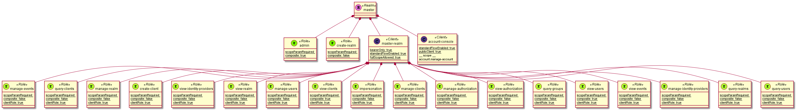

# Keycloak-graphical-representation

The main goal of this project is to generate quick representation of realm configuration based on plantuml.
This service would make easier understanding and conception of authentication process with Keycloak.




## Table of Contents
<details><summary>display</summary>

- [Keycloak-graphical-representation](#keycloak-graphical-representation)
  - [Table of Contents](#table-of-contents)
  - [Prerequisites](#prerequisites)
  - [Installing](#installing)
  - [Usage](#usage)
  - [Versioning](#versioning)
  - [Changelog](#changelog)
    - [0.1.0 (Work in progress)](#010-work-in-progress)
  - [TODO](#todo)
  - [Authors](#authors)

</details>

## Prerequisites

* Node >=12
* [Keycloak](https://www.keycloak.org)
* Plantuml viewer ([vscode](https://marketplace.visualstudio.com/items?itemName=jebbs.plantuml))

## Installing

```
npm install
```

## Usage

```
node index.js -h
```
example:
```
docker run --rm -d  -p 8180:8080 -e KEYCLOAK_USER=keycloak -e KEYCLOAK_PASSWORD=keycloak jboss/keycloak
node index.js -u keycloak -p keycloak -s http://localhost:8180 -r master -o master.puml -f "(test|test1)"
code master.puml
```

## Versioning

We use [SemVer](http://semver.org/) for versioning. 

## Changelog

### 0.1.0 (Work in progress)

* Manage roles, realm, client
* Filter default clients and roles
* Convert description to notes using `-n` option
* Add help command
* Add regexp filter
* Create a standalone version 
* Add options to filter default clients and roles

## TODO

* Improve roles management

## Authors

Malys